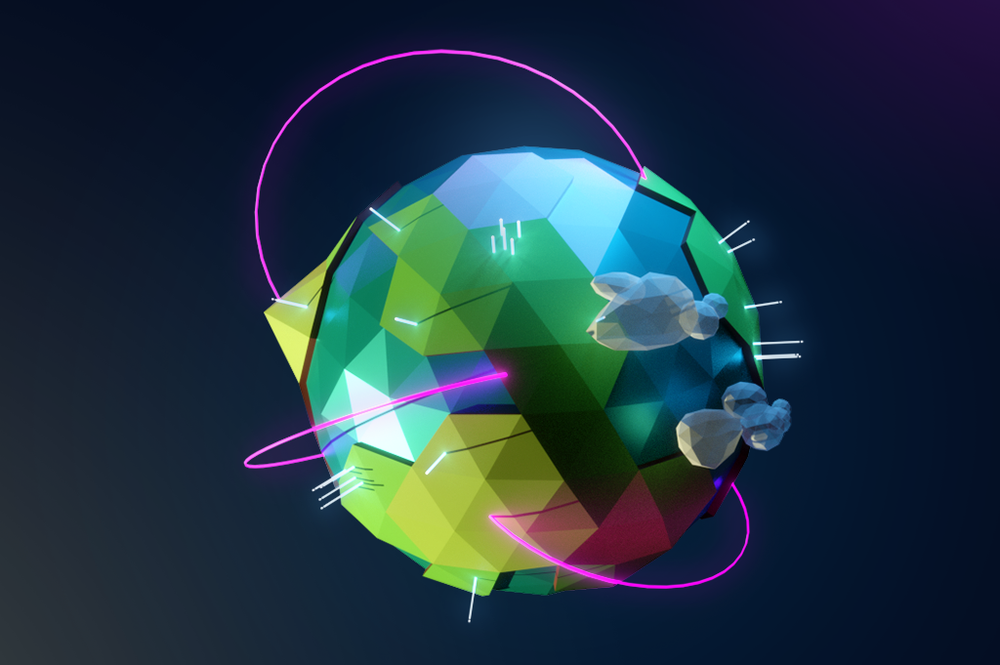
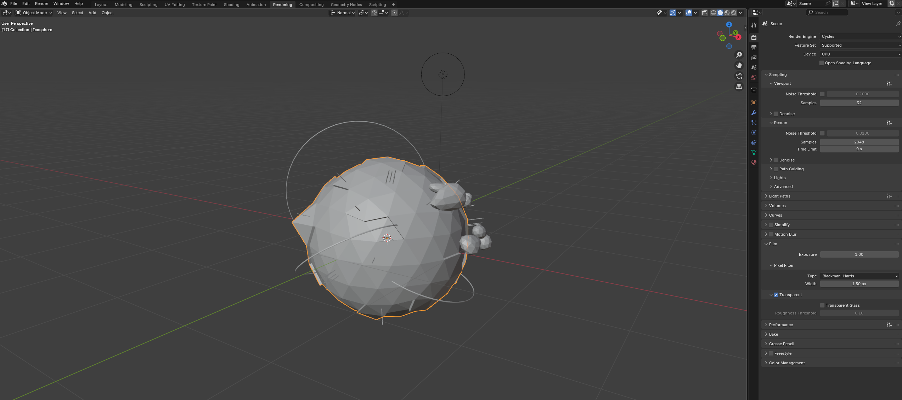
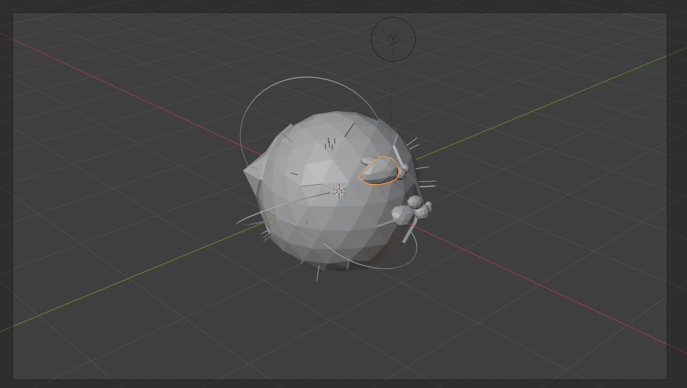
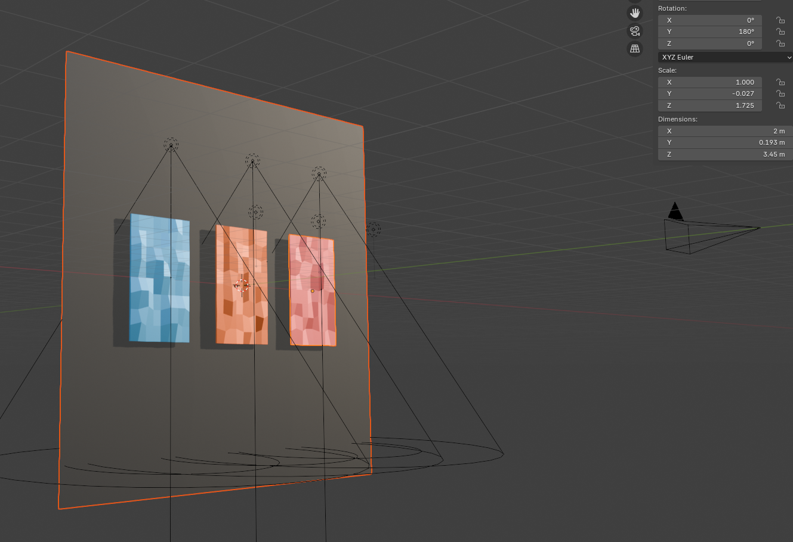
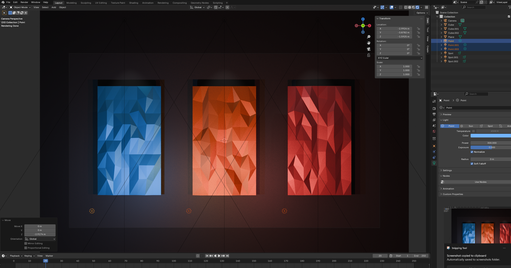
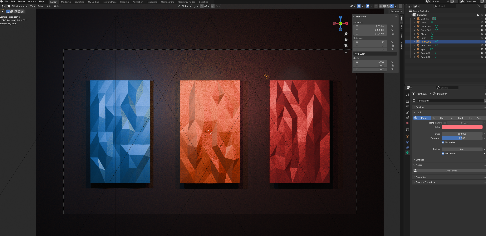
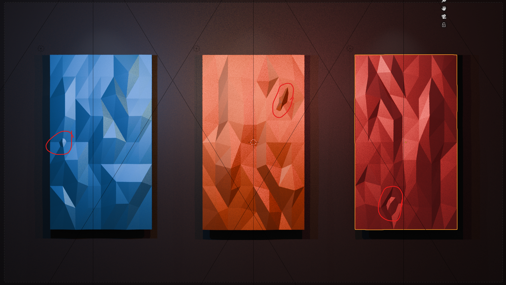
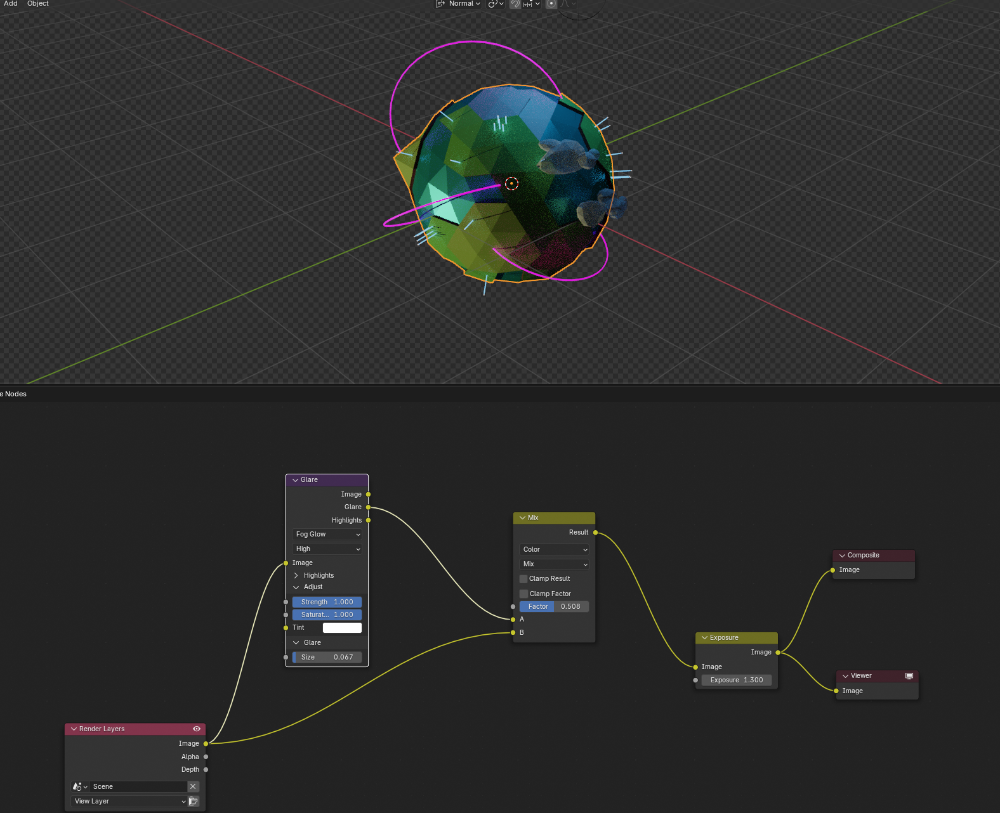

Every blog post needs a header image. At least, I think it does.

In the age of AI generation, I worry that all the hard work I do can get lost in the slop. Part of this post is about showing how proud I am of the work I put into these posts. AI has changed the way we think about design, and I feel like it can minimize the effort artists put into passion projects when anything can be made with a simple prompt. Apparently, the new competition for a carefully made image is a sentence that starts with “make it look cool.”

Way back when, I tried integrating this mesh-like design pattern into my branding by incorporating a low-poly aesthetic. It was intended to be an homage to my passion for game development. There are still artifacts from that era in this current iteration of my site, including the fact that I still make all my header images with a low-poly aesthetic.

For this site, I make those images myself in Blender. I've been using Blender for about 20 years now, which is a slightly alarming amount of time to have spent staring at a gray cube. It started with 3D and game design, but it has stuck around as one of my favorite ways to make graphics for the web.

The writing and code are the obvious parts of a blog post. The header image is the less obvious part. It is also where I can spend a surprising amount of time. A good header has to communicate something about the post, fit the shape of the page, and still look interesting when it is reduced to a thumbnail.

## Starting with an idea

I usually begin with the subject of the post. Thankfully, I'm almost always talking about something I made, so translating an interface or design to the 3D world is fairly straightforward. What's tricky is when I'm doing a technical write-up about a front-end framework. I end up simply rendering a low-poly icon, but the 3D visual aesthetic is always more engaging than a simple 2D vector. Also, it gives me an excellent excuse to turn a one-hour article into an afternoon project.

Sometimes the connection between the physical elements, lighting, and color is more about the mood or the visual language. The important thing is having one strong idea before opening Blender. Otherwise, I quickly get lost making something technically interesting that has nothing to do with the post.

The mesh from the GitHub globe is a good example. The mesh itself is made from simple primitives, but the visual language started with the combination of GitHub's color palette and my low-poly aesthetic: irregular triangles, simple lighting, and a limited palette.

## Building the scene

Most of the scenes start simply. I create the main object with simple quad or triangular faces, set up a camera, add a few lights, and switch to Blender's Cycles rendering engine.

The first version is usually quite good. Cycles does a lot of heavy lifting right out of the gate, which is convenient because I would prefer not to do all of it myself. The camera matters most at this stage. A model can look great from one angle and completely unremarkable from another. For more complex scenes like this globe, I'll move some of the objects around to create visual balance from the camera's point of view. I leave enough space around the subject so the image still works at different screen sizes, too.

The dimensions of my banner have changed over the years, so going into this I try to make sure the object is centered and the output can easily be scaled to different resolutions.

For a generated or low-poly aesthetic, flat shading is important. That simply means avoiding the "Shade Smooth" option.

I also need to think about the background. In some of my more recent posts, I've used a plain plane (heh!) with a medium or dark gray color. I'll rely on the scene's lights to cast shadows and color onto the plane to give it depth.

In my earlier scenes, however, I'd simply fill the empty area with a solid color. This still works for more complex 3D shapes where the background could add too much noise to the image, but for more of the flat designs it feels too... empty.

## Color and lighting

Once the composition is working, I spend a lot of time on color. This is probably the least exciting part to describe and one of the most important parts to get right.

I try a few different light patterns, move the key light around, and adjust the fill light(s) until the object separates from the background. Small changes can completely alter the image. A light that is a little too bright can flatten the geometry, while a background that is a little too close in value can make the subject disappear by not casting shadows.

Here you can see where I adjusted the fill lights to cast from above versus below. Since my key light was casting from above, it was creating too many shadows around the cards, which made it difficult to tell where the light was coming from. These subtle adjustments can take a long time to get right. The final result may look effortless, which is a lovely way for it to hide the effort.

The goal is not always realism. For these headers I am usually looking for a clean, graphic result. The render needs to survive being compressed, cropped, and viewed alongside the rest of the site. If the lighting only looks good at full size, it probably is not finished yet.

## Modeling for the header

I always model each header from scratch. I never reuse geometry or a scene because I spend more time trying to clean up and adjust old values than actually creating something. I also usually go into a scene with an idea of what I want to create, and looking at an old scene can influence and skew what I'm trying to make.

This makes the process quite slow. Even a simple object can need several rounds of adjustments:

- Refine the silhouette
- Simplify or exaggerate the geometry
- Find a camera angle that reads clearly
- Test the object against different backgrounds
- Render a few variations and compare them at thumbnail sizes for different screens

I also adapt my method of creating the low-poly aesthetic depending on the subject. In the end, I'm looking to tie the images together by showing the faces of the mesh, but how I do that can change. For example, on the GitHub globe, I simply use a triangular-faced sphere with smooth shading turned off. That works well for a 3D object, but it doesn't work as well for the interactive card header.

For those instances, Blender has a helpful selection option in vertex mode called "Select Random." I select random vertices on the mesh, offset them slightly on the x, y, and z axes, select another random group, and repeat the process until it looks like a true low-poly mesh and the faces really stand out. It is a very scientific process, assuming your definition of science includes repeatedly clicking a button until the model looks better.

## Rendering and revising

When I think the image is close, I render a few versions. I look for distracting edges, awkward empty areas, and places where the subject gets lost in the crop. Then I make another render pass until everything looks good.

Here's an example where the back of the mesh on the cards is clipping through the front. This is a result of the "random selection" method from above, and it is difficult to see these artifacts until after a render. Blender is happy to let you believe everything is fine right up until it produces photographic evidence to the contrary.

This is where the time adds up. A single render might be quick since the scenes are fairly simple, but deciding that the camera should move a little, changing the light, rendering again, and checking the result on the actual blog page takes longer than the final image suggests. The image may look simple, but “simple” is often what remains after removing all the evidence of the work.

From there comes the post-process compisiting and revisions. This is where things can get messy if I over do it, and I tend to over do it. 

The compositing layer can add a lot of alteration to my image, so adding a simple glare, mixing it, and adjusting the exposure a bit is usually enough.

## Why Blender is still part of my web workflow

Blender might seem like an unusual tool for making images for a web blog, but it fits the way I like to work. It gives me control over the camera, lighting, materials, geometry, and composition in one place. It also lets me make something original for each article instead of searching for a stock image that is close enough.

After 20 years, Blender is familiar enough that I can use it as a sketchbook. I can test an idea quickly, make something more polished when the idea works, or throw the whole thing away when it does not. That last option is important too.

The headers take time, but that time is part of making the post. Writing about a project and building a visual identity for it are connected activities. Sometimes the image helps me understand what the post is actually about. Sometimes the post gives me a reason to make an image I would not have made otherwise.

There is no grand secret to the process. It is mostly years of practice, a lot of small decisions, a quick BFA, and being willing to render one more version before calling it finished. And then one more version after that, because apparently the previous version had opinions.

**Keep on building!**