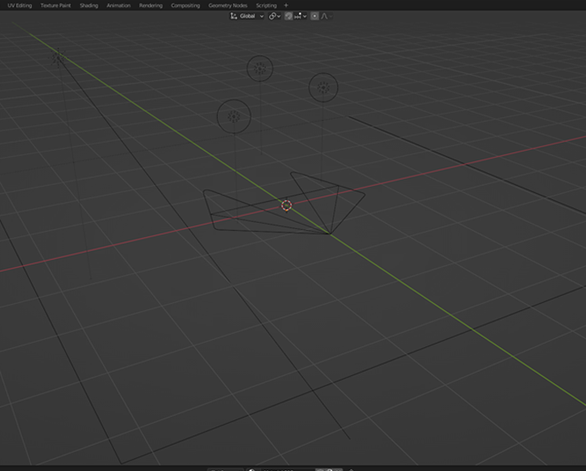
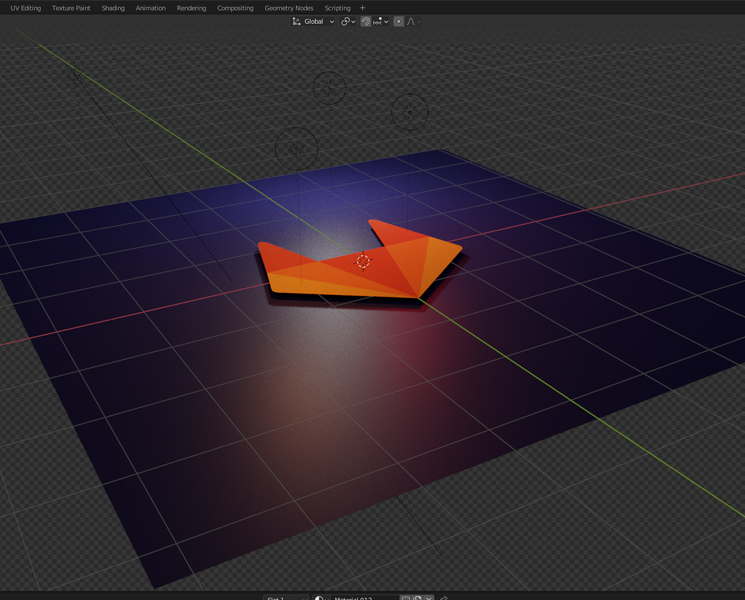
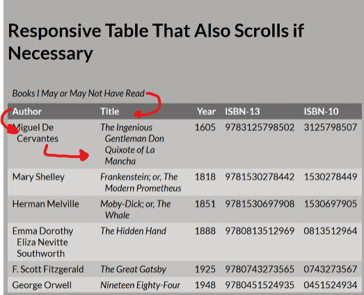
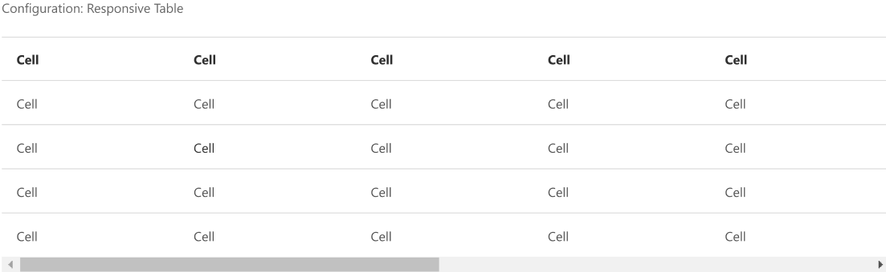
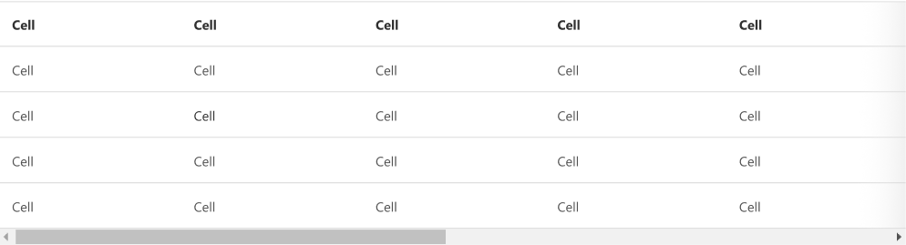
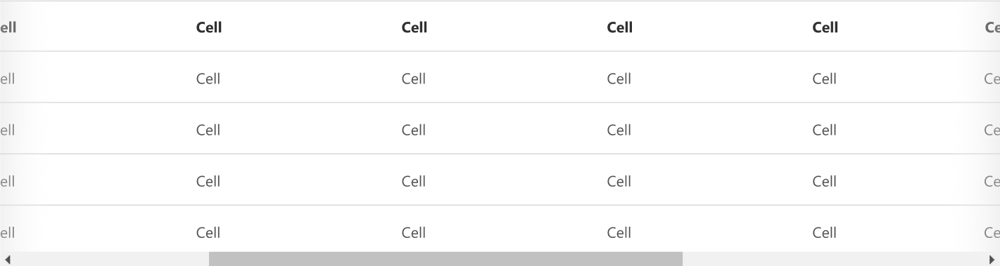
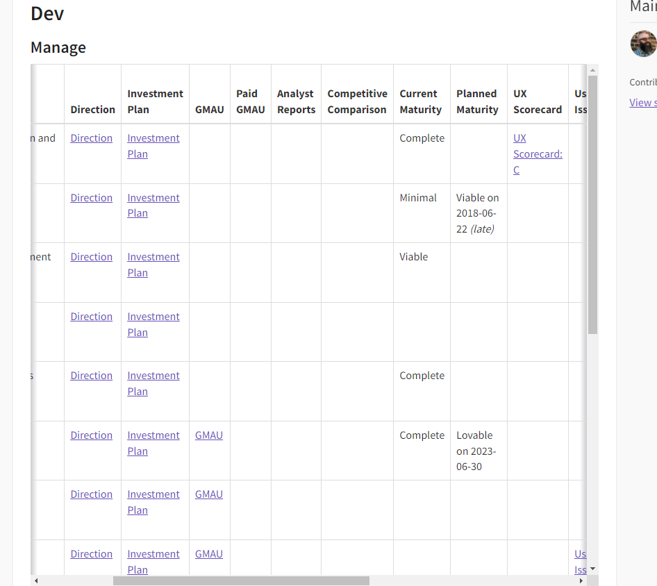

This is a write-up exploring an open issue in GitLab's Pajamas Design System. I really appreciate GitLab's open and collaborative approach to their platform, and this felt like a great opportunity to dig into a real, public design problem and think through it end to end starting from research and ending with a working implementation.

## Setting Up

To start, I had to familiarize myself with GitLab and the Pajamas Design System. I spent some time going through the GitLab Design System documentation and getting acquainted with Pajamas. I went through the issue tracker to find an issue I'd like to contribute to that didn't already have significant groundwork completed. That's when I settled on [this responsive table states issue](https://gitlab.com/gitlab-org/gitlab-services/design.gitlab.com/-/issues/1282).

I liked this issue because it would let me show both design/UX thinking and coding ability, with a strong focus on accessibility — which matters a lot to me in day-to-day design work.

### Sidebar
And this is where it gets a bit meta. At this point I needed a bit of a break to let all this information settle in. So, in the meantime, I decided to get this blog set up and plan my execution.

As with all the blogs on my website, I always start with a low-poly 3D render for the thumbnail image. GitLab's logo is already following this polygonal design. Thank you for making this easy for me!

<div class="columns is-mobile widealign">
<div class="column is-6">



<p class="has-text-centered"><small>Wireframe view of GitLab logo in Blender</small></p>
</div>
<div class="column is-6">



<p class="has-text-centered"><small>Render view of GitLab logo in Blender</small></p>
</div>
</div>

The [color palette](https://design.gitlab.com/product-foundations/colors) and [press kit](https://about.gitlab.com/press/press-kit/) came in handy while creating this scene. The most challenging part was accurately capturing GitLab's color palette while also trying to light the scene with colored lights. Colored lights always influence the color of materials unless you overpower them with a neutral source.

For the final render, I wanted to have a bit more color in the scene because the edges of the mesh felt sharp and unrealistic. I didn't want to use bloom, since I didn't want a consistent glow effect on the entire image. Instead, I used a few point lights around the scene to illuminate and simulate a bloom effect on only a few parts of the model. I like how it turned out.

## Exploring the Table Issue

Okay, back to work! In exploring the [responsive table issue](https://gitlab.com/gitlab-org/gitlab-services/design.gitlab.com/-/issues/1282), there's an [example of a table where the number of columns begins to negatively impact the display of the table](https://about.gitlab.com/handbook/product/category-health/).

In the Resources section of the issue, there's an example of [a responsive table](https://adrianroselli.com/2017/11/a-responsive-accessible-table.html) that changes layout on smaller screen views.

### Pros
It's a great solution in that it helps accomplish a number of issues
- First, it's agnostic of the number of columns. It'll move all columns to a row-like format to display the content.
- No information is cut off. You do not have to rely on two-dimensional scrolling to get all the content.
- Edd S, the author, carefully considered accessibility as shown in [their supporting slides](https://speakerdeck.com/edds/what-even-is-a-table-a-quick-look-at-accessibility-apis?slide=67).

### Cons
- The display of the content is different between mobile and desktop. This requires the user to relearn the UI if experiencing both views.
- The title of the table becomes the table head. Though it looks great, this is not semantically proper.
- It is a bit over engineered. It requires JavaScript to recreate the table for a specific view.
- This write up was created in 2015, technology has changed quite a bit since then.
- Does not consider multi-dimensional tables

Here I try to outline what elements of the table move and where they move to:



That's a lot of moving content. I feel like this approach is a bit over engineered and I can find a more responsive and accessible solution. The solution here may be pretty simple: horizontal scrolling.

Let's go to the drawing board ...

## Table design in Figma
I cloned the Pajamas component library Figma file to begin exploring options. In the Table component page, I duplicated the table a few times to have several different options to play with. Pajamas does not do any customization to the scroll bar so, to start, I recreated the default Chrome scrollbar and applied it to the bottom of the table.



Great! This solution will allow me to use semantic HTML and ARIA attributes for the most accessible experience. I can also use [webkit to allow overflow scrolling](https://developer.mozilla.org/en-US/docs/Web/CSS/-webkit-overflow-scrolling) on mobile, but I can do a bit better.

From a UX standpoint, I can still see an opportunity for improvement.

In the example screenshot I show above, there are additional columns outside of the view. Currently, the only indicator that there are additional columns is the scrollbar. Chrome on mobile, by default, will not show the scrollbar until you interact with the table. If the table happens to be perfectly positioned to cut off columns, the user may not know to scroll over to view more content.

There needs to be an additional visual cue to ensure users know there is some content off screen. I added a subtle gradient to the edge of the table that could help accomplish this:


If the user begins scrolling, I can fade this gradient in on the other side to show there is content outside of the view on both sides:


## Design Accessibility Considerations
This proposed solution works well in that it's responsive and agnostic of screen size.

The subtle gradient indicators that imply more content is out of view help those that may not have a scroll bar visually present. It's another subtle indicator to reinforce interaction without infringing on the visuals of the table.

This method will rely on native, semantically correct HTML to allow screen readers to natively integrate with the display of the table. I won't need to reinvent a table layout for mobile.

## Implementation
To round out the exploration, I wanted to show how I'd actually implement this solution, with consideration to the limitations of frontend technology — bridging the design thinking with a working, coded solution.

Given the core framework is built on Bootstrap, I'll also use Bootstrap to implement my suggestions. First off, here's the final table:

<div class="spacer-sm"></div>
<iframe height="620" style="width: 100%;" scrolling="no" title="Untitled" src="https://codepen.io/joshsalazar/embed/LYeMJva?default-tab=" frameborder="no" loading="lazy" allowtransparency="true" allowfullscreen="true">
  See the Pen <a href="https://codepen.io/joshsalazar/pen/LYeMJva">
  Untitled</a> by Joshua Salazar (<a href="https://codepen.io/joshsalazar">@joshsalazar</a>)
  on <a href="https://codepen.io">CodePen</a>.
</iframe>
<div class="spacer-sm"></div>

The table is no longer constrained on the x-axis. Adding Bootstrap's ```table-responsive``` class allows me to achieve that. It appears the front-end is built on Bootstrap v.3.4.1 so [responsive tables are available](https://getbootstrap.com/docs/3.4/css/#tables-responsive). The ```table-responsive``` class adds an overflow-x property and sets it to auto. This allows it to confine itself to the space of the parent and overflow the content into a scroll.

On the same ```table-responsive``` class, I'm applying some css to make the gradients to indicate overflowing content.

```css
background-image: 
    linear-gradient(to right, white, white), 
    linear-gradient(to right, white, white), 
    linear-gradient(to right, rgba(0, 0, 20, .20), rgba(255, 255, 255, 0)), 
    linear-gradient(to right, rgba(255, 255, 255, 0), rgba(0, 0, 20, .20));
  background-position: left center, right center, left center, right center;
  background-repeat: no-repeat;
  background-color: white;
  background-size: 20px 100%, 20px 100%, 10px 100%, 10px 100%;
  background-attachment: local, local, scroll, scroll;
```

In short, this code is creating four background images. Two images are simple white boxes and two images are the dark linear gradients. Those linear gradients are bound to the edges of the container but the two white boxes are set to the outer bounds of the nested content (in this case, the edges of the table). When the user scrolls to one end of the table, the white box will overlay the linear gradient. This effect will indicate the end of the content by hiding the gradient.

Applying this code to the table on the example from the issue, we can start to see it in action:



## Implementation Accessibility Considerations
Semantically, the table is fairly simple. I'm using the ```scope``` attribute to help screen reader users by announcing columns and rows, but there are a few more things I can do to increase the usability of the table. As the tables become more complex, more table attributes such as the headers (with associated ```<th>``` id), colspan, etc. can be used. ARIA roles, properties, states, and tabindex attributes can also be [implemented into the table](https://www.w3.org/TR/wai-aria-practices/examples/table/table.html).

## Final Thoughts
I began exploring max-height tables to further enhance the experience of the tables. One issue I often experience with long tables that have horizontal scrolling: you have to scroll to the bottom of the table to find the scroll bar, then scroll over, then scroll back up to the content you wanted to view. I can fix this by making sure the table views are constrained to a user's viewport by setting the ```max-height``` of the table to roughly ```75vh```. That way, no matter what screen you're viewing the table on, you can always pan in two dimensions without having to navigate to the bottom of the table.

This would be a great example where UX research could help identify all use cases prior to starting design ideation.

I was also a bit hesitant to showcase my code implementation. I don't consider myself a frontend engineer, though I am proficient in HTML/CSS/JavaScript. I hope the code implementation adequately shows my understanding of frontend technology without taking the spotlight away from the design and UX considerations, which are really the heart of this exploration.

If you've made it this far, thank you for following along. Though this example is fairly simple, I hope it adequately showcases the process and the fun of digging into a real design problem.

<strong>Have a great rest of your day! 👍</strong>
