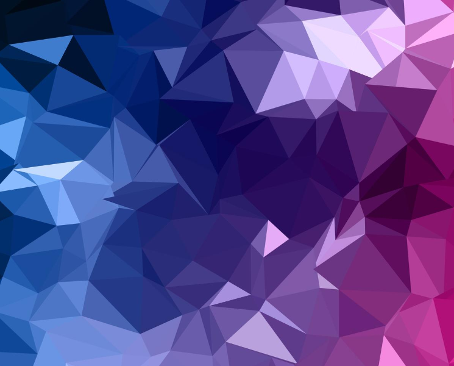
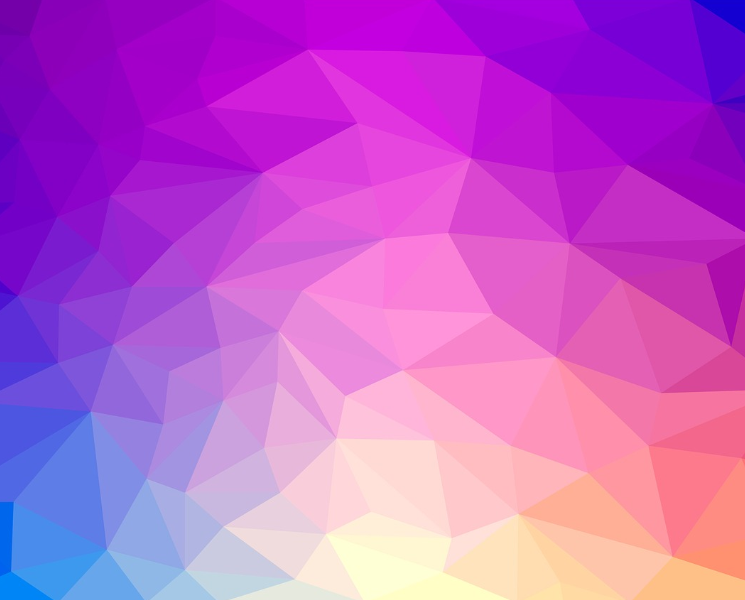
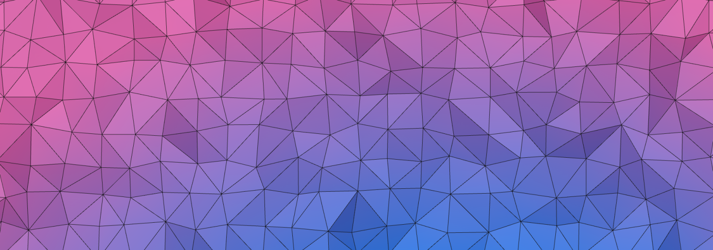
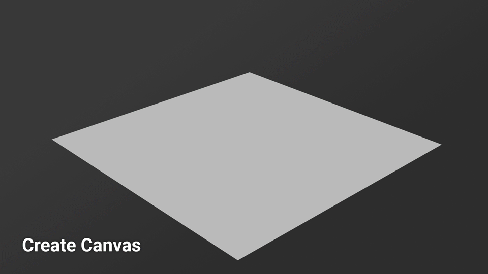

Though I still dabble with 3D and game design, my main focus has shifted to web. I believe that early experience in 3D design made picking up Three.js a bit easier.

I made this low-poly mesh generator at a time where I was also exploring new forms of generative art. The final product here will not have static color gradients, but dynamic color bands with multiple variables that create truly unique results each time to create a mesh.

**This is going to assume some knowledge of [Three.js](https://threejs.org/)**

## Inspiration and goal

I'm looking to create a semi-random low-poly mesh. Something minimal yet dynamic to provide a range of probability to keep the results unique and interesting. I'd also like to have some interaction. A single light source controlled by the user will allow interaction with the mesh and allow the user to explore the depth and material a bit more.

Here's some inspiration to get an idea of what I'm looking for.

<div class="columns is-mobile widealign">
<div class="column is-6">



<p class="has-text-centered"><small>Image By <a href="https://www.vecteezy.com/members/kjpargeter2018">Kirsty Pargeter</a></small></p>
</div>
<div class="column is-6">



<p class="has-text-centered"><small>Image By <a href="https://www.needpix.com/photo/1149776/low-poly-triangle-pattern-background-abstract-design-texture-presentation-brochure">Needpix.com</a></small></p>
</div>
</div>

The thing I love about these images is they have appealing gradient bands. They also have some representation of light. I really like how the light is interacting with the mesh to make the material appear shiny in the first image.

If you're curious how it ended up, jump down to the [Execution Summary](#execution-summary) to see the results.

## The gradient layer
I started with the gradient layer. The gradient layer would act as a reference for the mesh to get the colors. To achieve this, I created a temporary canvas and generated some radial color bands with some random values.

<div class="spacer-sm"></div>
<iframe height="300" style="width: 100%;" scrolling="no" title="Random Canvas Gradients" src="https://codepen.io/joshsalazar/embed/MWvPJaw?default-tab=result&theme-id=dark" frameborder="no" loading="lazy" allowtransparency="true" allowfullscreen="true">
  See the Pen <a href="https://codepen.io/joshsalazar/pen/MWvPJaw">
  Random Canvas Gradients</a> by Joshua Salazar (<a href="https://codepen.io/joshsalazar">@joshsalazar</a>)
  on <a href="https://codepen.io">CodePen</a>.
</iframe>
<div class="spacer-sm"></div>

The first thing I do is create a radial gradient in the [context of the canvas](https://developer.mozilla.org/en-US/docs/Web/API/CanvasRenderingContext2D/createRadialGradient). I'm using Three.js to get the random numbers but you can just as easily use [Math.random](https://developer.mozilla.org/en-US/docs/Web/JavaScript/Reference/Global_Objects/Math/random).

The first layer of randomization is the starting and ending x-values of the gradient band.

```javascript
var grd = ctx.createRadialGradient(
  THREE.Math.randFloat(-halfWidth / 2, halfWidth / 2) + halfWidth,
  height,
  THREE.Math.randFloat(5, 100),
  halfWidth,
  height,
  gradientRange
);
```

The second layer of randomization is selecting the number of gradient bands. I found 2-3 gradient bands to look the best. Given I'm creating truly random colors, more colors tend to get muddy when running together.

```javascript
var numOfGradientBands = Math.floor(THREE.Math.randFloat(2, 4));
```

The final layer of randomization is selecting the colors. This could be cleaned up by creating a function for the color generation instead of running through it for each color.

The [addColorStop() method](https://developer.mozilla.org/en-US/docs/Web/API/CanvasGradient/addColorStop) is taking two parameters; the offset and the color. For the most optimal results, I manually select the offset for each color band.

```javascript
var firstColorR = Math.floor(Math.random() * 255);
var firstColorG = Math.floor(Math.random() * 255);
var firstColorB = Math.floor(Math.random() * 255);

grd.addColorStop(
  0.25,
  "rgb(" + firstColorR + "," + firstColorG + ", " + firstColorB
);
if (numOfGradientBands == 3) {
  grd.addColorStop(
    0.35,
    "rgb(" +
      Math.floor(Math.random() * 255) +
      "," +
      Math.floor(Math.random() * 255) +
      ", " +
      Math.floor(Math.random() * 255)
  );
}
grd.addColorStop(
  0.45,
  "rgb(" +
    Math.floor(Math.random() * 255) +
    "," +
    Math.floor(Math.random() * 255) +
    ", " +
    Math.floor(Math.random() * 255)
);
```

And there I have our gradient applied to a canvas. I'll use this canvas as a reference to apply the color to my low-poly mesh later.

## Low-poly mesh layer

The mesh is a [BufferGeometry](https://threejs.org/docs/#api/en/core/BufferGeometry) mesh that is created with 1024 points using the [setFromPoints](https://threejs.org/docs/#api/en/core/BufferGeometry#setFromPoints) method. The points are a grid of 32 x 32 to give us the x and z dimensions of the mesh. The vertical y-height is randomized from 0 to 4 to give some variance in height.

The final level of randomization for this project is the position of those 1024 points. The variance variable below determines the randomized location of each point. Anything larger than 10 starts to give unexpected results for the next step.

```javascript
var variance = THREE.Math.randFloat(1, 10);
// generate 1024 verticies (32 * 32)
for (let i = 1; i < 33; i++) {
  for (let j = 1; j < 33; j++) {
    // width/height of screen / 32 segents * index / 5 (used to scale the mesh. Larger values = smaller mesh)
    let x = (visibleWidth / 32) * i + THREE.Math.randFloatSpread(variance);
    let z = (visibleWidth / 32) * j + THREE.Math.randFloatSpread(variance);
    let y = THREE.Math.randFloatSpread(4);
    points3d.push(new THREE.Vector3(x, y, z));
  }
}

var geometry1 = new THREE.BufferGeometry().setFromPoints(points3d);
```

Unfortunately, there isn't much to see at the end here. The points are applied to the mesh but they currently don't have faces.

### Applying faces to mesh with Delaunay triangulation

To triangulate the faces, I found this [Delaunay triangulation script](https://unpkg.com/delaunator@3.0.2/delaunator.js). It takes the point's x and y values, and returns a 2D array. The first dimension of the array is the array of faces. The second dimension consists of the three points for each face. This array is passed back to three.js and the normals recomputed.

```javascript
var indexDelaunay = Delaunator.from(
  points3d.map((v) => {
    return [v.x, v.z];
  })
);

// delaunay index => three.js index
var meshIndex = [];
for (let i = 0; i < indexDelaunay.triangles.length; i++) {
  meshIndex.push(indexDelaunay.triangles[i]);
}

// add three.js index to the existing geometry
geometry1.setIndex(meshIndex);
geometry1.computeVertexNormals();

// get the geometry points using attributes.position.count
const count = geometry1.attributes.position.count;
// assign a color attribute to geometry points
geometry1.setAttribute(
  "color",
  new THREE.BufferAttribute(new Float32Array(count * 3), 3)
);
```

### Coloring the points of the mesh

Now I have a mesh with triangulated faces from a set of randomized points. The next trick is getting the colors applied to the faces.

Remember that canvas with the gradient from earlier? I sample that canvas to map the RGP pixel data to a 32x32 2d array. 32x32 is also the number of points on the mesh so I pass the color array to each point on the mesh.


```javascript
var pixels = []

// Map the pixel data (RGB) to an array
for (var a = 1; a < 33; a++) {
  for (var b = 1; b < 33; b++) {
    var pixel = ctx.getImageData(
      (tempCanvas.width / 32) * a,
      (tempCanvas.height / 32) * b,
      1,
      1
    ).data;
    pixels.push(pixel);
  }
};

// get the geometry points using attributes.position.count
const count = geometry1.attributes.position.count;

// assign a color attribute to geometry points
geometry1.setAttribute(
  "color",
  new THREE.BufferAttribute(new Float32Array(count * 3), 3)
);

const color = new THREE.Color();
const positions1 = geometry1.attributes.position;
const colors1 = geometry1.attributes.color;

// Generate color
color1 =
  "rgb(" +
  Math.floor(Math.random() * 255) +
  "," +
  Math.floor(Math.random() * 255) +
  "," +
  Math.floor(Math.random() * 255);

for (let i = 0; i < count; i++) {
  color.setRGB(pixels[i][0] / 255, pixels[i][1] / 255, pixels[i][2] / 255);
  colors1.setXYZ(i, color.r, color.g, color.b);
}
```

To apply the colors to the points on the mesh, the vertexColors value of the mesh has to be set to true.

```javascript
var mesh = new THREE.Mesh
  geometry1,
  new THREE.MeshPhongMaterial({
    color: 0xffffff,
    opacity: 1,
    vertexColors: true,
    flatShading: true,
    shininess: 30
  })
);
```

And here are the results:

<div class="spacer-sm"></div>
<iframe height="300" style="width: 100%;" scrolling="no" title="Low-Poly Generator" src="https://codepen.io/joshsalazar/embed/XWaxpVM?default-tab=result&theme-id=dark" frameborder="no" loading="lazy" allowtransparency="true" allowfullscreen="true">
  See the Pen <a href="https://codepen.io/joshsalazar/pen/XWaxpVM">
  Low-Poly Generator</a> by Joshua Salazar (<a href="https://codepen.io/joshsalazar">@joshsalazar</a>)
  on <a href="https://codepen.io">CodePen</a>.
</iframe>
<div class="spacer-sm"></div>

Hooray! The mesh is done.

## Lighting and effects

To get that final result I was going for, I wanted to get a shiny material applied to the mesh along with a light controlled by the use. At this point, I also felt like the edges of the triangles were a bit hard to see, so I added a wireframe mesh to outline the triangles.

### Wireframe mesh

The wireframe mesh is simply a duplicate of the gradient mesh using [LineSegments](https://threejs.org/docs/#api/en/objects/LineSegments).

```javascript
const wireframeGeometry = new THREE.WireframeGeometry(geometry1);
const wireframeMaterial = new THREE.MeshBasicMaterial({ color: 0x111111 });
const wireframe = new THREE.LineSegments(
  wireframeGeometry,
  wireframeMaterial
);
mesh.add(wireframe);
wireframe.position.y = 2;
```



### Lighting and material

For lighting, I removed the light that illuminated the scene and added a small point light that followed the mouse around. To add further interaction, within the animate loop, I checked if the mouse was pressed and moved the light further away from the mesh to illuminate more of it.

Finally, I added some shininess to the material of the base mesh. The material is a [MeshPhongMaterial](https://threejs.org/docs/?q=phong#api/en/materials/MeshPhongMaterial) with a shininess value of 30.

```javascript
var mesh = new THREE.Mesh(
  geometry1,
  new THREE.MeshPhongMaterial({
    color: 0xffffff,
    opacity: 1,
    vertexColors: true,
    flatShading: true,
    shininess: 30
  })
);
```

<h2 id="execution-summary">Execution Summary</h2>

And there we have it! Our final scene is done!

**Press down on the left mouse button to make the light grow**

<div class="spacer-sm"></div>
<iframe height="600" style="width: 100%;" scrolling="no" title="Low-Poly Generator" src="https://codepen.io/joshsalazar/embed/eYEPgyB?default-tab=result&theme-id=dark" frameborder="no" loading="lazy" allowtransparency="true" allowfullscreen="true">
  See the Pen <a href="https://codepen.io/joshsalazar/pen/eYEPgyB">
  Low-Poly Generator</a> by Joshua Salazar (<a href="https://codepen.io/joshsalazar">@joshsalazar</a>)
  on <a href="https://codepen.io">CodePen</a>.
</iframe>
<div class="spacer-sm"></div>

1. Generate a gradient on an HTML canvas
2. Create 1024 points in three.js and place them within the viewport
3. Take 1024 points from the gradient canvas and apply them to the 1024 points from three.js
4. Run the 1024 points through a Delaunay triangulation script
5. Offset the points
6. Duplicate mesh and apply wireframe material


